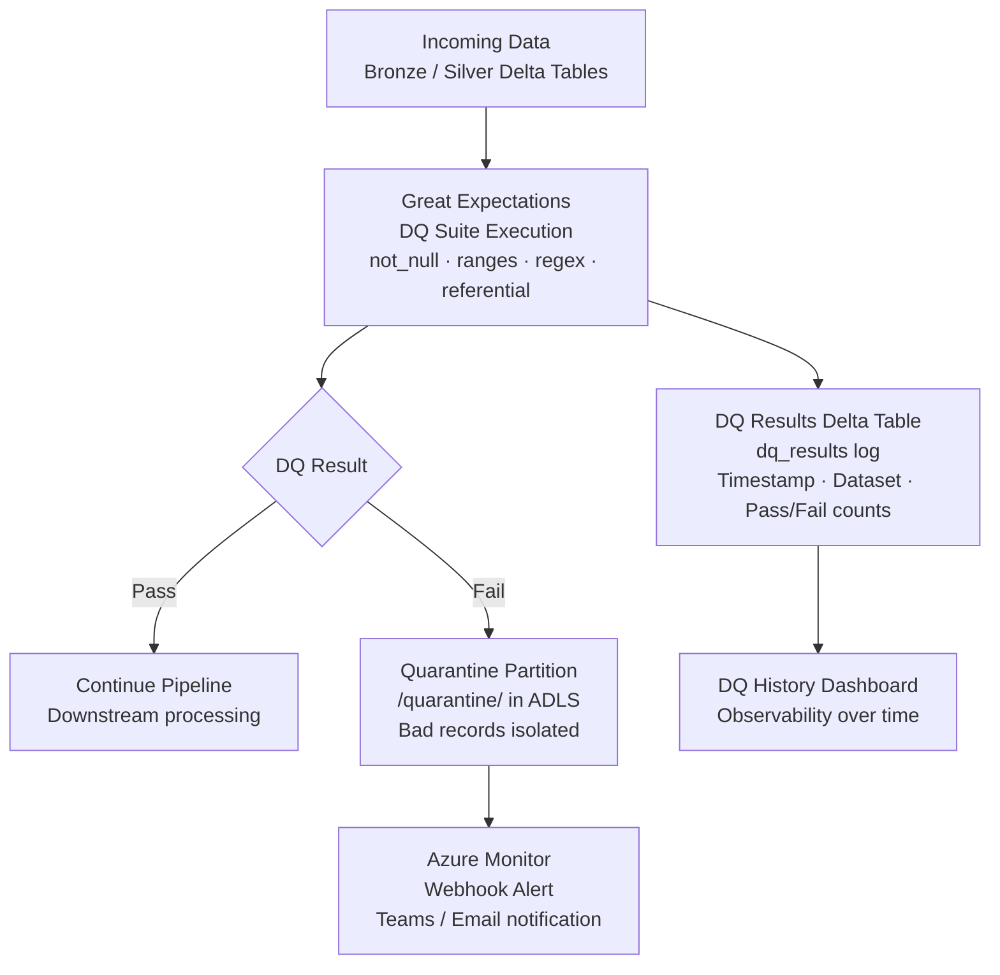

# Data Governance & Quality Framework on Azure
 
> Reusable data quality framework on Azure Databricks — Great Expectations suites for automated DQ checks, results logged to Delta Lake, bad records quarantined, and Azure Monitor alerts on failures.
 
[](https://greatexpectations.io)
[](https://azure.microsoft.com/en-us/products/databricks)
[](https://delta.io)
 
---
 
## 🏗️ Architecture
 

 
---
 
## 📂 Folder Structure
 
```
data-governance-quality-azure/
├── expectations/
│   ├── orders_suite.json           # GE expectation suite for orders
│   └── customers_suite.json        # GE expectation suite for customers
├── notebooks/
│   ├── 01_run_dq_checks.py         # Execute GE suites on Delta tables
│   └── 02_quarantine_bad_records.py
├── scripts/
│   ├── dq_runner.py                # Run suites + log results to Delta
│   └── alert_notifier.py           # Teams/email on DQ failures
├── data/
│   └── sample_with_quality_issues.csv
├── tests/
└── README.md
```
 
---
 
## ✨ Key Features
 
- **Great Expectations** — column-level checks: not_null, value ranges, regex, referential integrity
- **Quarantine pattern** — bad records isolated to `/quarantine/`, never silently dropped
- **DQ results Delta table** — full history of every check run with pass/fail counts
- **Azure Monitor alerts** — Teams webhook fires on DQ failure with dataset + expectation details
- **Plug-and-play** — add any Delta table, define a YAML suite, get coverage instantly
---
 
## 📖 Related Reading
 
- [Medallion Architecture Explained](https://medium.com/@agrimk16/medallion-architecture-explained-a-practical-guide-for-data-engineers-173d205a6505)
- [Mastering Delta Lake Performance](https://medium.com/@agrimk16/mastering-delta-lake-performance-z-ordering-vs-liquid-clustering-in-2025-d59023b9c9be)
---
 
## 🔗 More Projects
 
| Repo | Description |
|---|---|
| [ecommerce-data-lakehouse-azure](https://github.com/agrimk16/ecommerce-data-lakehouse-azure) | Medallion lakehouse with ADF + Databricks |
| [retail-dbt-pipeline-azure](https://github.com/agrimk16/retail-dbt-pipeline-azure) | ELT with dbt on Databricks |
| [Portfolio Index](https://github.com/agrimk16/azure-data-engineering-portfolio) | All projects overview |
 
---
 
**Agrim Kumar** · [LinkedIn](https://linkedin.com/in/agrimk) · [Medium](https://medium.com/@agrimk16)
 
